# GYM database system - DBMS project 2018
基於MySQL的資料庫查詢系統，用來管理健身房
## Environment
  * C#(MySQL Server先啟動，再將資料庫連線，才能使用)
  * MySQL[需下載MySQL Workbench來管理資料庫內容](https://dev.mysql.com/downloads/installer/)
  ###Setup
## Diagrams
### ER Diagram
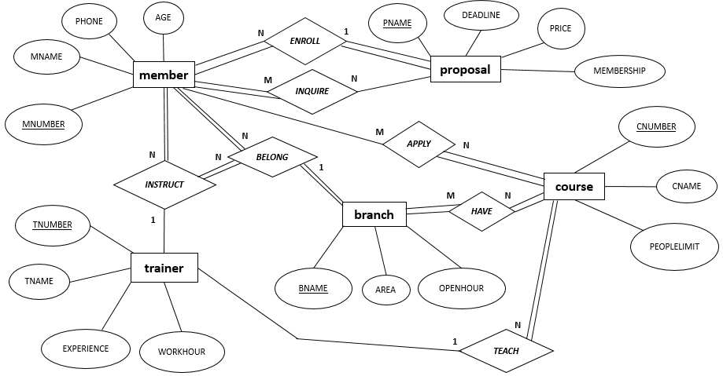
#### Attribute
* **member**:健身房的學員
  * MNUMBER:學員的編號
  * MNAME:學員的名字
  * PHONE:學員的手機
  * AGE:學員的年齡
  * TNO:學員的教練編號
  * PNAM:學員使用的方案名稱
* **trainer**:健身房的教練
  * TNUMBER:教練的編號
  * TNAME:教練的名字
  * EXPERIENCE:教練的教學資歷
  * WORKHOUR:教練的上班時間
* **proposal**:方案
  * PNAME:方案的名稱
  * DEADLINE:方案的使用期限
  * PRICE:方案的價錢
  * MEMBERSHIP:是否需繳入會費
* **course**:課程
  * CNUMBER:課程的編號
  * CNAME:課程的名稱
  * PEOPLELIMIT:課程的人數上限
  * TNUM:課程的教練編號
* **branch**:健身房的分店
  * BNAME:分店名稱
  * AREA:分店所在的區域
  * OPENHOUR:分店的營業時間
#### Relationship
* trainer **INSTRUCT** member:每個教練可以指導很多學員，但每個學員一定要有教練且只能有一個
* member **ENROLL** proposal:每個學員一定要報名方案且只能報名一種，但每種方案可以有很多學員報名且一定有人報名
* member **INQUIRE** proposal:每個學員一定會詢問很多個方案，而且每個方案一定也有很多個學員詢問
* member **APPLY** course:每個學員可能會報名很多個課程，但不一定每個人都會報名課程，每個課程一定會有很多學員報名
* branch **HAVE** course:每個分店一定擁有很多個課程，而且每種課程一定被很多個分店擁有
* trainer **TEACH** course:每個教練可能教很多個課程，但不一定每個教練都有教，但每個課程一定有教練教學
* member **BELONG** branch:每個學員一定屬於某個分店，而且每個分店一定有很多個學員
* trainer **BELONG** branch:每個教練一定屬於某個分店，而且每個分店一定有很多個教練
### Relation Schema
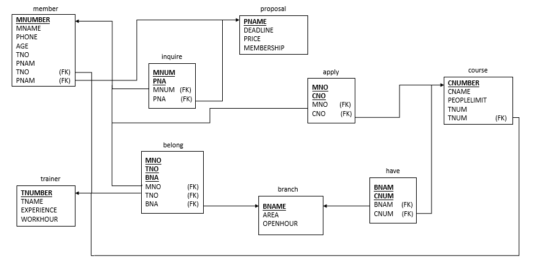
## Usage
這個系統主要分兩種操作方式，SQL以及Button
### SQL
* 提供直接輸入SQL指令來操作資料庫
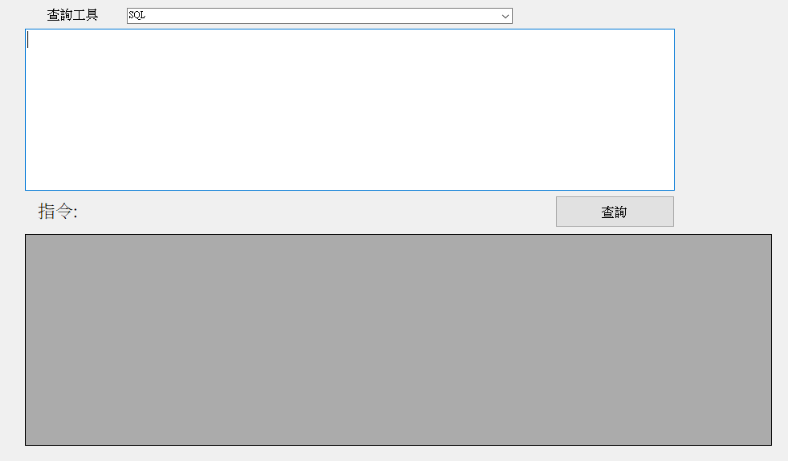
#### SQL Input Example
* Basic queries:
```sh
select * from member
delete from member where MNUMBER='1'
insert into member values ('16','彭大名','0955555555','25','5','嘗試看看')
update member set TNO='1' where MNUMBER='3'
```
* Nested queries:
```sh
select * from member where TNO in (1,2,3)
select * from member where TNO not in (1,2,3)
select MNAME from member where exists(select * from trainer where TNUMBER='1')
select MNAME from member where not exists(select * from trainer where TNUMBER='1')
```
* Aggregate functions:
```sh
select count(PNAME) from proposal
select sum(PEOPLELIMIT) from course 
select max(PRICE) from proposal 
select min(PRICE) from proposal 
select avg(PEOPLELIMIT) from course 
select TNUMBER,EXPERIENCE from trainer having EXPERIENCE>5
```
### Button
* 提供較為介面化的按鈕式操作
* 共有4種操作動作:
  1. 新增資料
  2. 搜尋資料
  3. 刪除資料
  4. 更新資料
* 可以透過簡單的輸入來達到某些SQL指令
#### Button Input Example
* Basic queries:
  * select:選擇要的表格後按check，要找的資料選擇好即按check，如要同時查詢多個資料，每選一個就按check，在條件區選擇要的資料，底下即輸入條件(ex:選擇MUNMBER輸入'15')後按check，如要同時選擇多個條件，每選好輸入好一個就按check
  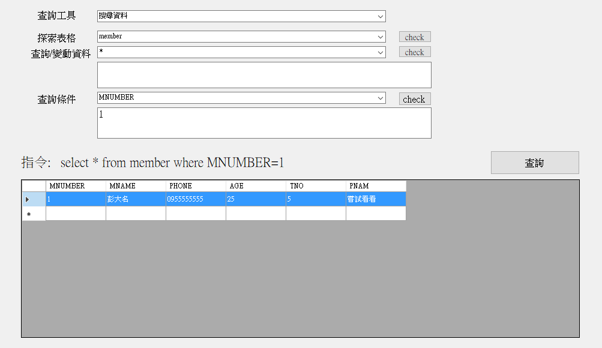
  * delete:選擇要的表格後按check，在條件區選擇要的資料，底下即輸入條件(ex:選擇MUNMBER輸入'15')後按check，如要同時選擇多個條件，每選好輸入好一個就按check
  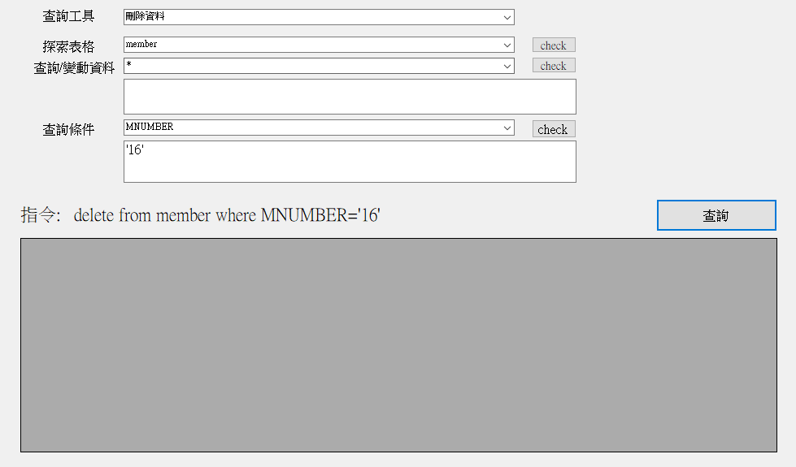
  * insert:選擇要的表格後按check，在資料區選擇要的資料，底下即輸入內容(ex:選擇MUNMBER輸入'15')後按check，依序操作要輸入的每個資料
  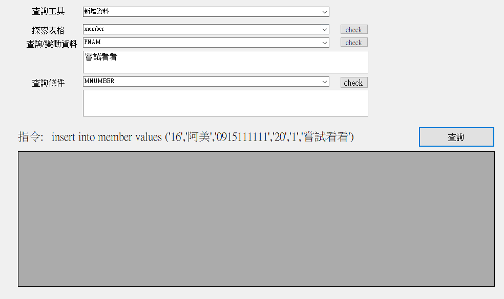
  * update:選擇要的表格後按check，在資料區選擇輸入要改變的資料後按check，在條件區選擇輸入要的條件後按check
  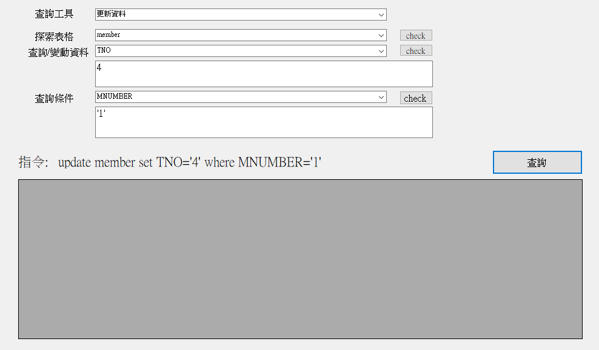
* Nested queries:
  * in.not in:在條件區選擇IN或NOT IN，在底下輸入要的資料後按check，然後一樣再底下輸入要找的條件
  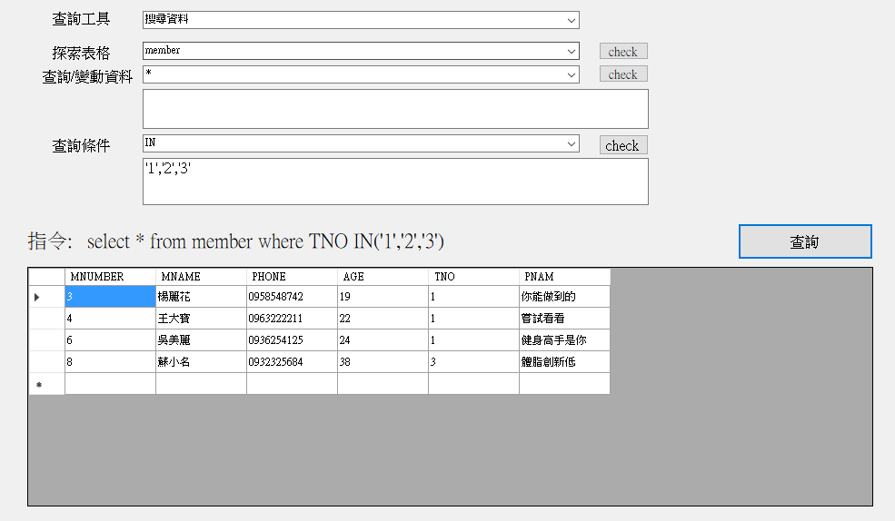
  * exists.not exists:在條件區選擇EXISTS或NOT EXISTS後按check，再來依照select方法
  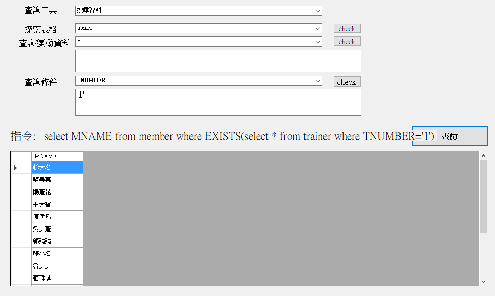
* Aggregate functions:
  * count.sum.max.min.avg:在資料區選擇COUNT或SUM或MAX或MIN或AVG，底下輸入要計算的資料後按check，如果要選擇條件，底下輸入需輸入(==.>=等等)
  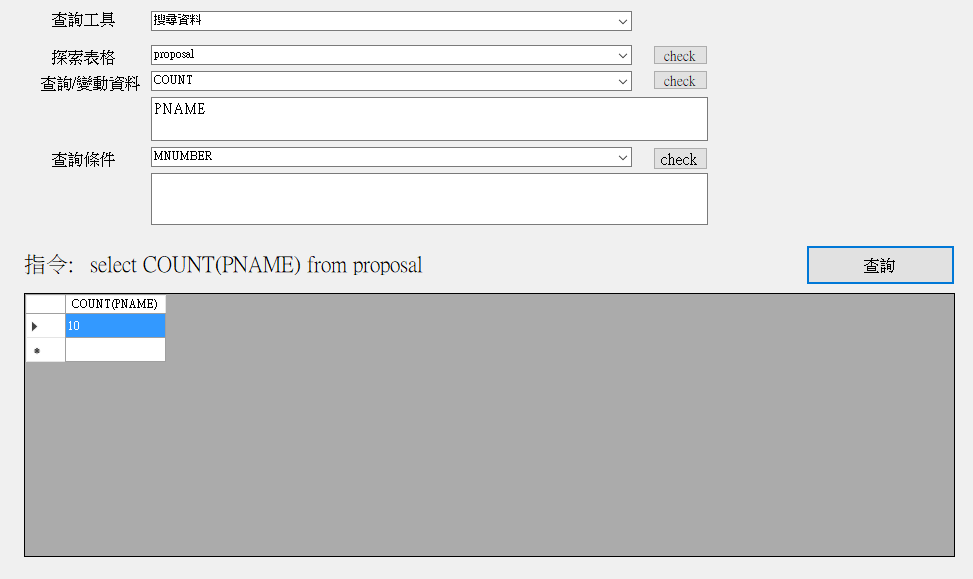
  * having:在條件區選擇HAVING後按check，在選擇要的條件，底下輸入需輸入(=,>=,!=等等)
  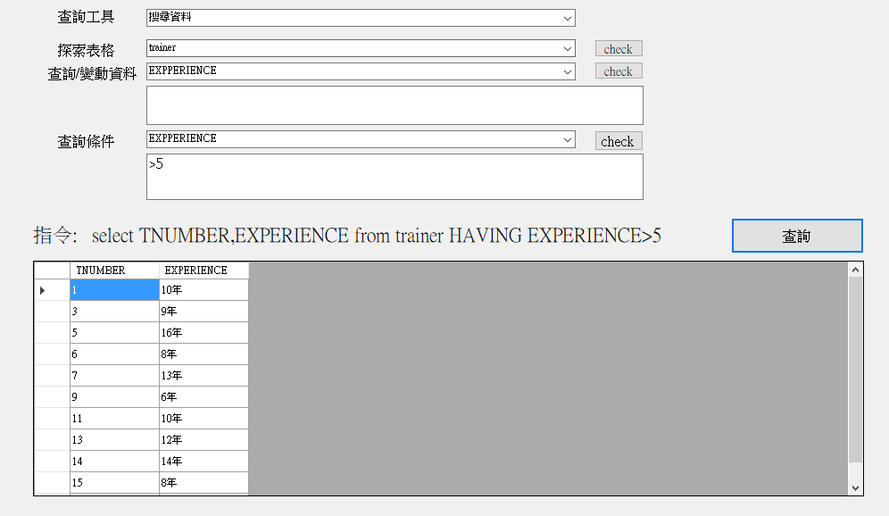
####  p.s.在條件區，如果輸入的資料是attribute不用加單引號(ex:MNUMBER)，其他則需要(ex:'陳曉明')
### Result
只有搜尋資料會顯示結果，新增刪除更新資料皆不會，但是都會顯示使用者點選完的指令
